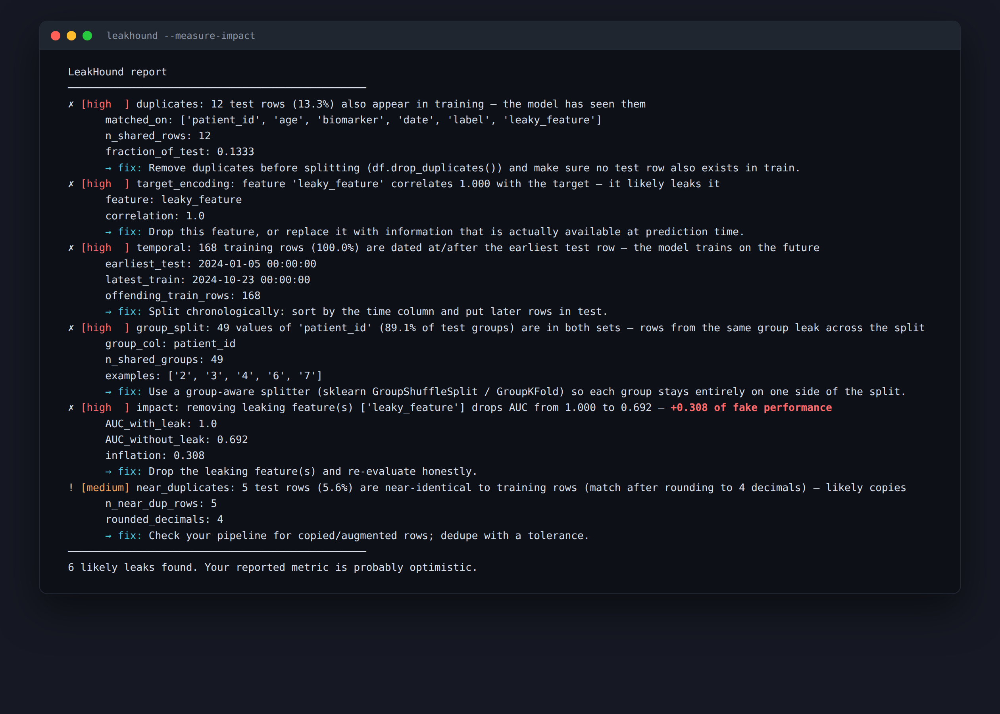
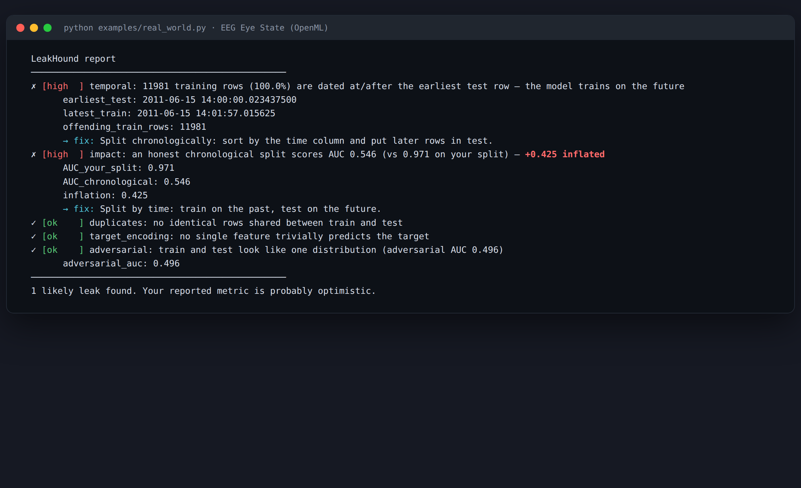
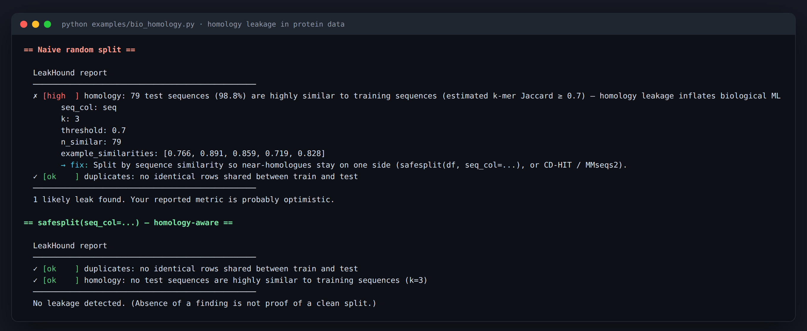
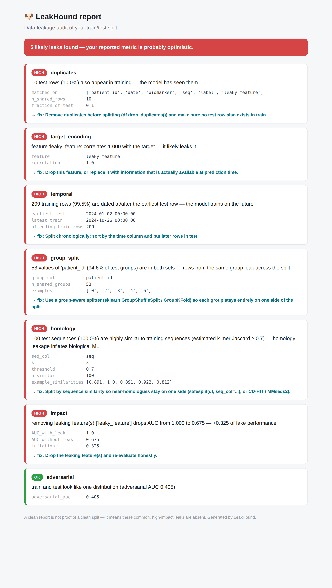

# 🐶 LeakHound

**Sniff out data leakage in your ML train/test split — before it fools you.**

> 📖 **New here? Start with the [step-by-step Getting Started guide](GETTING_STARTED.md).**

Your model posts a beautiful AUC. You're about to ship it, or submit the paper.
Then you find out the test set shared rows with training, or a feature quietly
encoded the label. The real number was mediocre. You almost shipped a lie to
yourself.

LeakHound points at your split and, in one command, tells you whether that
beautiful number is real — and **exactly how much of it is fake**.

```bash
pip install leakhound-ml          # imports and runs as `leakhound`
leakhound --train train.csv --test test.csv --target label --measure-impact
```

```
  ✗ [high  ] target_encoding: feature 'leaky_feature' correlates 1.000 with the target — it likely leaks it
  ✗ [high  ] impact: removing leaking feature(s) ['leaky_feature'] drops AUC from 1.000 to 0.669 — +0.331 of fake performance
        AUC_with_leak: 1.0
        AUC_without_leak: 0.669
        inflation: 0.331
        → fix: Drop the leaking feature(s) and re-evaluate honestly.
```

That second line is the point: your `0.95` was really `0.62`. LeakHound doesn't
just warn you — it **puts a number on the damage**.

<p align="center">
  
</p>

It exits non-zero when it finds leakage, so you can drop it into CI and **fail a
merge that would have shipped a leaky model**.

## It works on data you already trust

Point it at **EEG Eye State** — a real 15,000-row dataset from OpenML. The split
everyone writes by default (random 80/20) scores a beautiful **0.971 AUC**. But
it's one continuous recording, so neighbouring samples are almost identical:
split it honestly (past → future) and the score collapses to **0.546** — a coin
flip. That **+0.425** was pure leakage, and LeakHound flags it:

```bash
pip install 'leakhound-ml[impact]'
python examples/real_world.py
```

<p align="center">
  
</p>

## Built for biological data, too

Generic tools catch identical rows. They miss **homology leakage** — test
sequences that are merely *similar* to training ones, which wrecks protein/DNA
models. LeakHound estimates k-mer similarity (pure Python) and flags it; its
companion [safesplit](https://github.com/happyhellpt/safesplit) splits so
near-homologues never span the split:

<p align="center">
  
</p>

```bash
python examples/bio_homology.py
```

## Why I built this

I once watched a model of mine post a score I was proud of. Then I looked closer:
the test set shared rows with training, and the gains evaporated the moment I
sealed a truly independent set. I had to retract my own claim.

The tooling for this is weak — everyone *knows* leakage is the number-one way ML
results turn out to be fiction, and almost no one checks for it systematically.
So I built the check I wish I'd run the first time.

## What it catches

| Check | What it finds |
|---|---|
| **duplicates** | Identical rows that live in both train and test |
| **near_duplicates** | Rows that are the same after tiny rounding — copies you didn't notice |
| **temporal** | Training rows dated at/after the earliest test row — the model trains on the future |
| **target_encoding** | A feature (often an ID) that predicts the label almost perfectly |
| **group_split** | The same patient / user / device on both sides of the split |
| **adversarial** | Whether a model can tell your train and test apart (distribution shift or split leakage) |
| **homology** | Test sequences (protein/DNA) *similar* — not identical — to training ones |
| **impact** | *How much* AUC/R² each leak is inflating — the honest score vs the fake one |

Every finding comes with the evidence **and a one-line fix**.

## Highlights

- **`--measure-impact`** — fits a quick baseline and reports the honest score
  next to the inflated one. (Needs `pip install 'leakhound[impact]'`.)
- **`--auto`** — point it at a single file and it guesses the target / time /
  group columns and warns you *before* you split.
- **`--html report.html`** — a self-contained, shareable report you can send to
  a colleague or attach to a PR.
- **`--seq-col`** — homology-aware leakage detection for **protein/DNA** datasets (pure Python; no MMseqs2/CD-HIT needed). The leak generic tools miss.
- **Cross-platform** — Windows, macOS, Linux; auto-falls back to plain ASCII on
  legacy terminals.

<p align="center">
  <br>
  <sub><i>The <code>--html</code> report — shareable, self-contained, light/dark aware.</i></sub>
</p>

## Use it from Python

```python
import pandas as pd
from leakhound import audit

report = audit(train_df, test_df, target="label", time_col="date",
               group_col="patient_id", measure_impact=True)
print(report.render())
if not report.clean:
    raise SystemExit("leakage detected")
```

## Try the demo

```bash
git clone https://github.com/happyhellpt/leakhound && cd leakhound
pip install -e '.[impact]'
python examples/demo.py   # builds a dataset with planted leaks and catches them
```

## A word of honesty

A clean LeakHound report is **not proof** your split is sound — it means these
specific, common leaks aren't present. And `--measure-impact` is a *quick
baseline estimate*, not a definitive number. Leakage is open-ended; this catches
the ones that bite most often.

## License

GNU AGPL-3.0-or-later © 2026 Joel Gomes.

Using LeakHound inside a **closed-source product or a hosted service**? The AGPL requires you to release your source under the same license. If that doesn't work for you, a **commercial license is available** — open an issue or get in touch.
